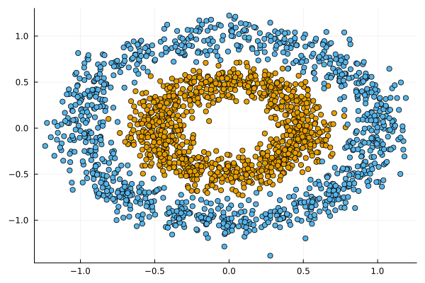

# `JointEnergyModels.jl`


*Joint Energy Models in Julia.*

[](https://juliatrustworthyai.github.io/JointEnergyModels.jl/stable) [](https://juliatrustworthyai.github.io/JointEnergyModels.jl/dev) [](https://github.com/juliatrustworthyai/JointEnergyModels.jl/actions/workflows/CI.yml?query=branch%3Amain) [](https://codecov.io/gh/juliatrustworthyai/JointEnergyModels.jl) [](https://github.com/invenia/BlueStyle) [](LICENSE) [](https://pkgs.genieframework.com?packages=JointEnergyModels)

`JointEnergyModels.jl` is a package for training Joint Energy Models in Julia. Joint Energy Models (JEM) are hybrid models that learn to discriminate between classes $y$ and generate input data $x$. They were introduced in Grathwohl et al. (2020), which provides the foundation for the methodologies implemented in this package.

## 🔁 Status

This package is still in its infancy and the API is subject to change. Currently, the package can be used to train JEMs for classification. It is also possible to train pure Energy-Based Models (EBMs) for the generative task only. The package is compatible with `Flux.jl`. Work on compatibility with `MLJ.jl` (through `MLJFlux.jl`) is currently under way.

We welcome contributions and feedback at this early stage. To install the development version of the package you can run the following command:

``` julia
using Pkg
Pkg.add(url="https://github.com/juliatrustworthyai/JointEnergyModels.jl")
```

## 🔍 Usage Example

Below we first generate some synthetic data:

``` julia
nobs=2000
X, y = make_circles(nobs, noise=0.1, factor=0.5)
Xplot = Float32.(permutedims(matrix(X)))
X = table(permutedims(Xplot))
plt = scatter(Xplot[1,:], Xplot[2,:], group=y, label="")
batch_size = Int(round(nobs/10))
display(plt)
```



The `MLJ` compatible classifier can be instantiated as follows:

``` julia
𝒟x = Normal()
𝒟y = Categorical(ones(2) ./ 2)
sampler = ConditionalSampler(𝒟x, 𝒟y, input_size=size(Xplot)[1:end-1], batch_size=batch_size)
clf = JointEnergyClassifier(
    sampler;
    builder=MLJFlux.MLP(hidden=(32, 32, 32,), σ=Flux.relu),
    batch_size=batch_size,
    finaliser=x -> x,
    loss=Flux.Losses.logitcrossentropy,
)
```

It uses the `MLJFlux` package to build the model:

``` julia
println(typeof(clf) <: MLJFlux.MLJFluxModel)
```

    true

The model can be wrapped in data and trained using the `fit!` function:

``` julia
mach = machine(clf, X, y)
fit!(mach)
```

The results are visualised below. The model has learned to discriminate between the two classes (as indicated by the contours) and to generate samples from each class (as indicated by the stars).


## 🎓 References

Grathwohl, Will, Kuan-Chieh Wang, Joern-Henrik Jacobsen, David Duvenaud, Mohammad Norouzi, and Kevin Swersky. 2020. “Your Classifier Is Secretly an Energy Based Model and You Should Treat It Like One.” In. <https://openreview.net/forum?id=Hkxzx0NtDB>.
